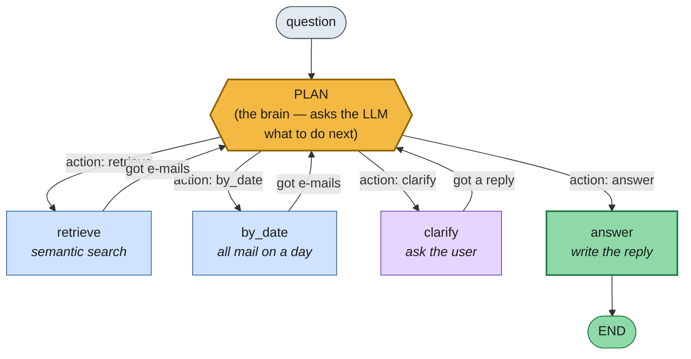
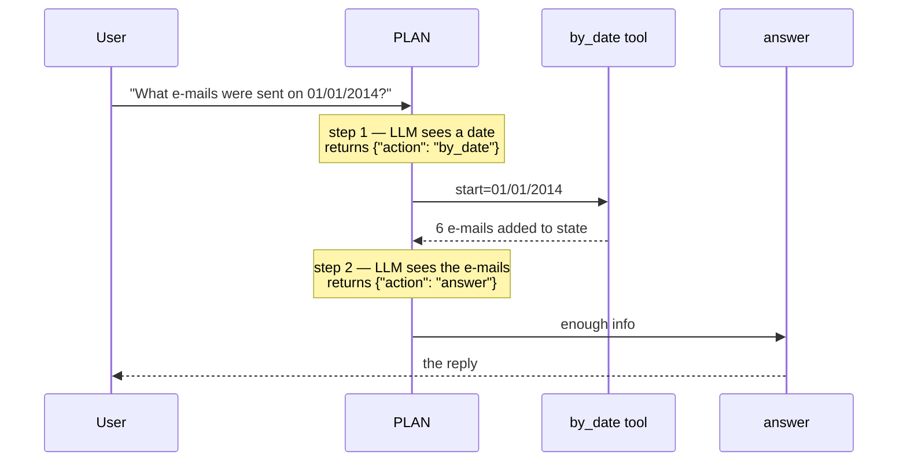

# Lab 5.2 — A Tool-Using Agent That Plans Which Action to Take

In Lab 5.1 the agent had one decision to make: *retrieve more, or stop?* Here it
gets a **menu of actions** and picks one on every step — semantic search, a date
lookup, asking the user a question, or answering. The agent also owns the chat
loop now, which is what lets it talk back mid-question.



**Read it as a hub and spokes.** `PLAN` is the hub. It picks one spoke, that
spoke does its job, and control comes straight back to `PLAN` — which now has
more information and picks again. Only `answer` breaks out to `END`.

A concrete run of *"What e-mails were sent on 01/01/2014?"*:



**The plan node emits JSON, and that JSON is the control flow:**

```text
   {"action": "retrieve",  "queries": ["budget approval 2015", ...]}   ──► search
   {"action": "by_date",   "start_date": "01/01/2014"}                 ──► date tool
   {"action": "clarify",   "clarification": "Which project do you mean?"} ──► ask
   {"action": "answer",    "reasoning": "have enough to respond"}      ──► reply
```

**State carries everything the plan node needs to decide:**

```text
    conversation_history   earlier turns — the agent has memory across questions
    clarification_history  Q&A pairs from clarify, fed back into planning
    executed_queries       so it doesn't repeat a search
    email_bodies           accumulates across BOTH tools, deduped by filename
    iterations             counts steps; at MAX_ITERATIONS planning is skipped
    mode                   "chat" (can ask the user) or "batch" (never blocks)
```

---

## Folder layout

```text
lab-5.2/
├── Live_Guided_Virtual_Lab_5_2_starter/
│   ├── lab_5_2_tool_using_agent_starter.py    ← learners fill in 2 TODOs
│   ├── requirements.txt
│   └── detailedEmails/                        ← 7,894 .txt emails
└── Live_Guided_Virtual_Lab_5_2_solution/
    ├── lab_5_2_tool_using_agent_solution.py
    ├── requirements.txt
    ├── chroma_db/                             ← prebuilt vector DB
    └── detailedEmails/
```

> Filenames **must** follow `mail_MM_DD_YY_<id>.txt` — the date tool reads the
> date straight out of the filename, with no index or metadata involved.

## Setup

```bash
source .venv/bin/activate
pip install -r requirements.txt        # langgraph + python-dateutil on top of the usual stack
echo "OPENROUTER_API_KEY=sk-or-your-key-here" > .env
```

```bash
python lab_5_2_tool_using_agent_starter.py             # uses ./detailedEmails
python lab_5_2_tool_using_agent_solution.py <folder>
```

### What a run produces

Debug output is on, so each planning decision is printed:

```text
Tool-using research agent. Type your question; 'exit'/'quit' to stop.

You: What e-mails were sent on 01/01/2014?
[agent] action=by_date reasoning='The question names a specific date'
[agent] by_date 2014-01-01..2014-01-01: 6 e-mail(s)
[agent] action=answer reasoning='Have all e-mails from that date'

Assistant: ...

You: Tell me about the project.
[agent] action=retrieve reasoning='Vague, but try searching before asking'
[agent] retrieving for: 'project status update'
[agent] action=clarify reasoning='Several projects appear; need to narrow down'

Assistant: Which project do you mean — the government contract or the
           warehouse relocation?
You: the government one
[agent] action=answer reasoning='Clarified; retrieved e-mails cover it'
```

The `reasoning` field on every line is the agent narrating why it chose that
action — the single most useful thing to watch during the demo.

---

## Core concepts in this lab

- **Tool use** — the agent has several capabilities and must choose the right one.
  A researcher who can either search a library catalogue *or* pull a specific
  day's newspaper, and knows which question calls for which.
- **Planning as routing** — the LLM doesn't execute anything. It returns a JSON
  action, and ordinary Python code routes to the matching node. The model
  *chooses*; the code *does*. That separation is what keeps the agent debuggable.
- **Structured tools vs. semantic search** — "what was decided about the project?"
  needs meaning-based search; "what came in on 01/01/2014?" needs an exact filter.
  Embeddings are bad at precise dates, so a deterministic tool handles it.
- **Clarification as an action** — asking the user is a legitimate move, not a
  failure. Note the prompt restricts it to a *last resort, after searching* —
  otherwise the agent gets lazy and interrogates instead of working.
- **Conversation memory** — `conversation_history` persists across questions in
  `chat()`, so follow-ups like "the government one" resolve against earlier turns.
- **Chat mode vs. batch mode** — `clarify` blocks on `input()`, which would hang
  an automated test. `mode` makes the same graph safe to run unattended.

### The two tools compared

| | `retrieve` | `by_date` |
| --- | --- | --- |
| How it works | BM25 + vectors (Lab 2.2) | regex on filenames + date compare |
| Returns | top 5 most relevant | **every** e-mail in the range |
| Good for | topics, people, decisions | "on 01/01/2014", "that week" |
| Cost | 1 embedding call | none — pure file I/O |
| Guardrail | `NUM_RETRIEVED = 5` | `MAX_DATE_SPAN_DAYS = 7` |

Both write into the same `email_bodies` dict, so a question can mix the two and
the answer node sees one merged pile of e-mails.

### Quick comparison to Lab 5.1

| | Agentic retrieval (5.1) | Tool-using agent (5.2) |
| --- | --- | --- |
| Decision | continue or stop? | which of 4 actions? |
| Nodes | 2 | 5 |
| Tools | 1 (hybrid search) | 2 (+ clarify, + answer) |
| Who answers | `BaseRetriever` outside the graph | an `answer` node **inside** it |
| Talks to the user | no | yes — `clarify` |
| Memory across turns | no | yes |

The structural jump: in 5.1 the graph produced *context* and something else
wrote the answer. Here the graph owns the entire interaction, which is why
`ToolUsingAgent` no longer extends `BaseRetriever` at all.

---

## What is already provided (walk through, don't rewrite)

| Piece | Why it matters |
| --- | --- |
| The hybrid stack | Lab 2.2's code again — now just *one* of the agent's tools. |
| `PLAN_SYSTEM` | The action menu: the exact JSON schema, plus when to use each action. This prompt *is* the agent's policy. |
| `ANSWER_SYSTEM` | Grounding rules for the final reply, plus handling clarifications and the "Exiting" convention. |
| `_AgentState` | Eleven fields now, versus six in 5.1 — the cost of more capabilities. |
| `retrieve_node` | Unchanged from Lab 5.1. |
| `retrieve_by_date_node` | Wraps the date tool, tags `executed_queries` with `DATE:...` so planning can see it already ran. |
| `clarify_node` | Prints the question and blocks on `input()` in chat mode; records a placeholder in batch mode. |
| `answer_node` | Assembles conversation + clarifications + all e-mails, then produces the reply. Sets `done`. |
| `route_from_plan` | Maps the action string to a node name — and **validates**: `retrieve` with no queries falls through to `answer`. |
| `chat()` / `query()` | Interactive loop with memory vs. one-shot batch call. |

### Notes on a couple of non-obvious bits

- **`clarification_history` starts with the question itself** (`[question]` in
  `_run`), so the original wording is always visible to the planner even after
  several clarification rounds.
- **`pending_queries` also starts with the question**, but the entry point is
  `plan`, not `retrieve` — so unlike 5.1, nothing is searched until the agent
  decides to search.
- **`route_from_plan` guards against incoherent plans.** An action of `retrieve`
  with an empty `queries` list would otherwise loop forever doing nothing.
- **Dates come from filenames, not content.** `mail_01_01_14_225.txt` → Jan 1
  2014. Fast and index-free, but it means a misnamed file is invisible to the
  tool.
- **`query()` builds a fresh agent state each call** — no history leaks between
  test cases, which matters if you evaluate this with the Lab 3.1 harness.
- **`MAX_ITERATIONS = 5`** is higher than 5.1's 3, because steps are now smaller:
  a plan → retrieve → plan → clarify → plan sequence burns four of them.

---

## The two TODOs for learners

### Step 1 — `retrieve_by_date(start_date, end_date=None)`

```python
start = dateutil_parser.parse(start_date).date()
end = dateutil_parser.parse(end_date).date() if end_date else start
if (end - start).days > MAX_DATE_SPAN_DAYS:
    end = start + timedelta(days=MAX_DATE_SPAN_DAYS)      # clamp, don't dump the corpus
results = []
for path in glob.glob(os.path.join(self._emails_dir, "mail_*.txt")):
    m = _FILENAME_RE.match(os.path.basename(path))
    if not m:
        continue
    email_date = date(2000 + int(m.group(3)), int(m.group(1)), int(m.group(2)))
    if start <= email_date <= end:
        with open(path, encoding="utf-8", errors="replace") as f:
            results.append((os.path.basename(path), f.read()))
return results
```

Teaching points:
- **This is a deterministic tool — no LLM, no embeddings.** Agents need boring,
  exact capabilities as much as clever ones.
- `dateutil_parser.parse` accepts many formats, so the LLM's `"01/01/2014"` or
  `"January 1 2014"` both work. Tools should be forgiving at the boundary.
- **The 7-day clamp is a guardrail.** The LLM picks the range; nothing stops it
  asking for two years, which would push thousands of e-mails into the context.
  Clamping silently is friendlier than erroring.
- `2000 + int(m.group(3))` turns `14` into `2014` — fine for this corpus, and a
  good prompt for a quick word about assumptions in date handling.
- Missing `end_date` means a single day (`end = start`).

### Step 2 — `plan_node(state)`

```python
if state["iterations"] >= self._max_iterations:
    return {"next_action": "answer", "pending_queries": [], ...}   # force an exit

# Build context: conversation, clarifications, executed queries, e-mails (first 20)
response = self._llm.invoke([SystemMessage(content=PLAN_SYSTEM),
                             HumanMessage(content=user_content)])
raw = (response.content if hasattr(response, "content") else str(response)).strip()
if raw.startswith("```"):
    raw = raw.split("\n", 1)[-1].rsplit("```", 1)[0]
try:
    result = json.loads(raw)
    action = result.get("action", "answer")
except (json.JSONDecodeError, ValueError):
    action, result = "answer", {}          # unparseable ⇒ answer with what we have

if action == "retrieve":
    return {"next_action": "retrieve", "pending_queries": result.get("queries", []), ...}
if action == "by_date":
    return {"next_action": "by_date",
            "pending_date_range": {"start": result.get("start_date", ""), ...}, ...}
if action == "clarify":
    return {"next_action": "clarify",
            "clarification_question": result.get("clarification", "Could you clarify?"), ...}
return {"next_action": "answer", ...}
```

Teaching points:
- **Every branch clears the fields it isn't using.** Leaving a stale
  `pending_date_range` behind would make the next step fire the wrong tool —
  the most likely bug in this function.
- **Every failure path routes to `answer`.** Max iterations, bad JSON, unknown
  action — all end the conversation rather than looping. Same philosophy as 5.1.
- The planner sees **four** things: conversation, clarifications, executed
  queries, retrieved e-mails. Compare with 5.1's three — one more capability
  means one more kind of context to reason over.
- `.get("action", "answer")` and the `"Could you clarify?"` fallback mean a
  partially-formed reply still produces something sane.
- The fence-stripping is now familiar — fourth appearance of "the model returns
  text, we need data".

---

## Demo questions

| Question | Expected action |
| --- | --- |
| "What e-mails were sent on 01/01/2014?" | `by_date` — a precise date, wrong job for embeddings |
| "What was decided about the government project?" | `retrieve` — semantic |
| "Tell me about the project." | Searches, then likely `clarify` |
| "What happened the first week of January 2014?" | `by_date` with a range, clamped to 7 days |

**The closing demo:** ask the date question and the semantic question back to
back. Same agent, same code — two different tools chosen, with the reasoning
printed each time. Then ask the vague one and let it ask *you* a question;
answering it and watching the agent re-plan is the moment the whole module lands.

Worth ending honestly: this agent is a planner with two tools and a hard step
limit. Production agents add retries, tool-call validation, cost budgets, and
tracing — but the loop at the centre is exactly the one on screen.
